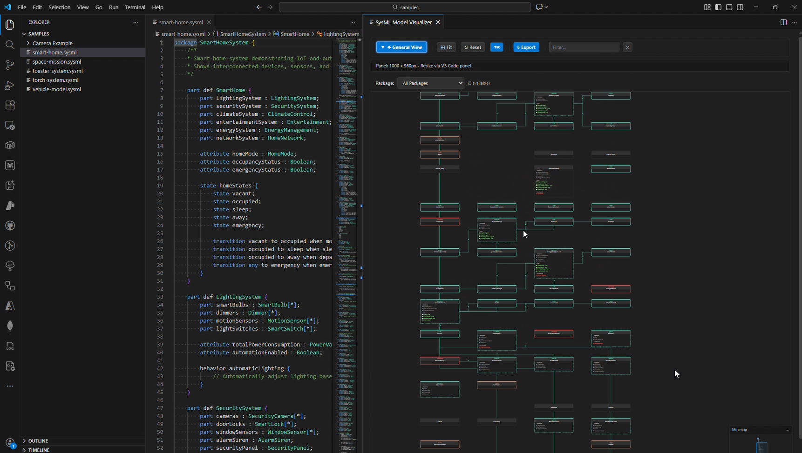
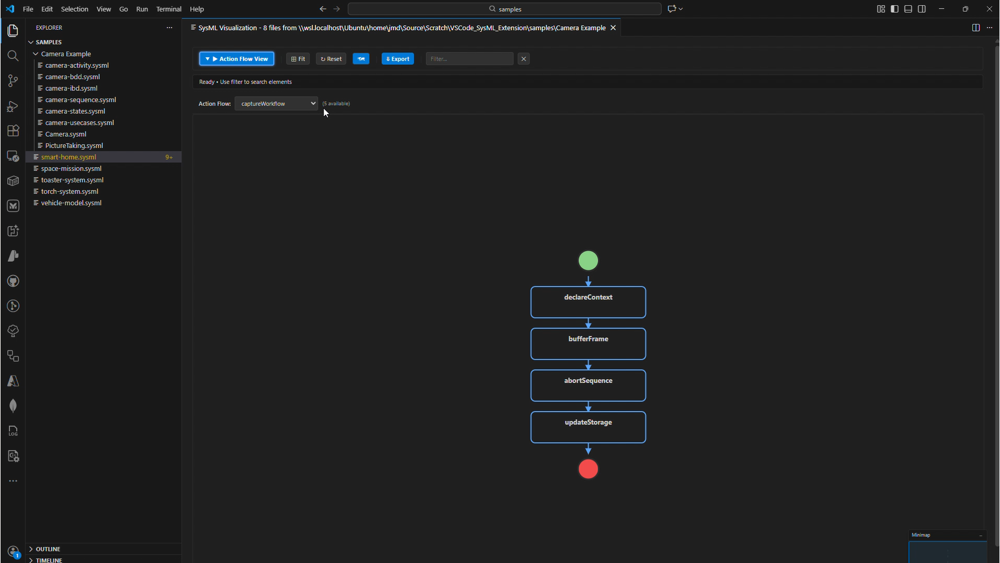
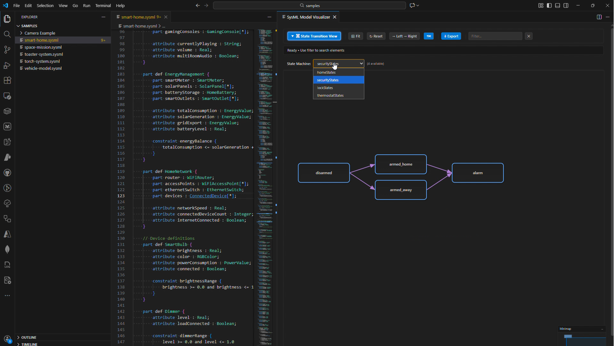
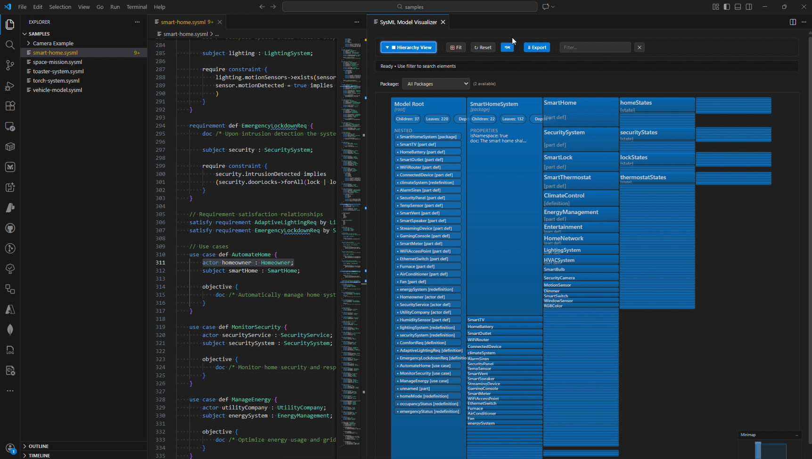
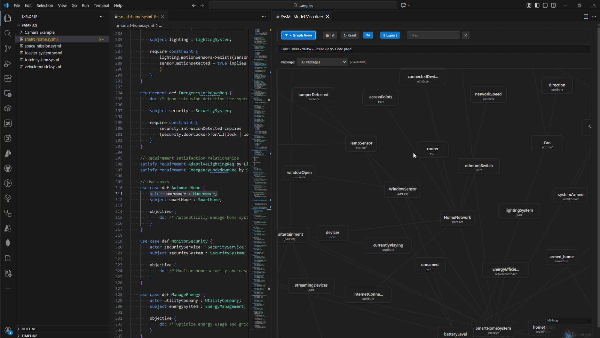
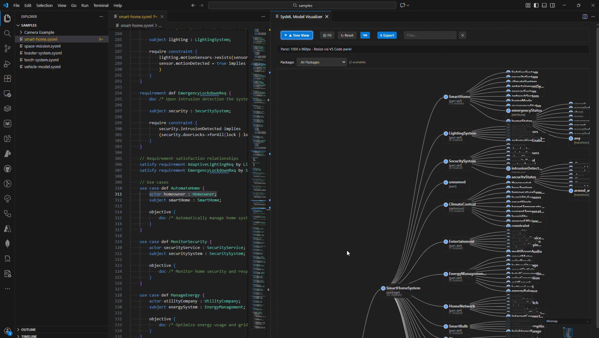

# SysML v2 VS Code Extension

A Visual Studio Code extension for SysML v2.0 with syntax highlighting, formatting, validation, navigation, and interactive diagram visualization.

  

## Features

- **Syntax Highlighting** - Full support for SysML v2.0 keywords, operators, and constructs
- **Standard Library** - Built-in OMG standard library (Kernel, Domain, Systems libraries)
- **Formatting** - Smart indentation and code formatting
- **Validation** - Real-time syntax and semantic checking with VS Code Problems panel integration
- **Navigation** - Go to Definition, Find References, Outline, Breadcrumbs, Symbol Search
- **Model Explorer** - Tree view showing packages and elements across your workspace
- **Interactive Diagrams** - General View, Interconnection View, Action Flow View, State Transition View, Sequence View, Case View and others with search/pan/zoom/export

## Demo

<video src="assets/visualiser.mp4" controls width="100%"></video>

## Screenshots

### General View



### Interconnection View


### Action Flow View



### State Transition View



### Hierarchy View



### Graph View



### Tree View



## Installation

1. Open VS Code Extensions (Ctrl+Shift+X)
2. Search for "SysML v2"
3. Click Install

Or install manually from `.vsix`: Extensions → ⋯ → Install from VSIX

## Usage

Create `.sysml` or `.kerml` files:

```sysml
package MySystem {
    part def Vehicle {
        attribute mass : Real;
    }
    part car : Vehicle;
}
```

### Commands (Ctrl+Shift+P)

| Command                        | Description              |
| ------------------------------ | ------------------------ |
| `SysML: Show Model Visualizer` | Open interactive diagram |
| `SysML: Validate SysML Model`  | Run validation           |
| `SysML: Format SysML Document` | Format current file      |
| `SysML: Export Diagram`        | Export as PNG/SVG        |

### Folder Visualization

Right-click any folder → "SysML: Visualize Folder" to aggregate and visualize all SysML files.

## Settings

| Setting                       | Default | Description          |
| ----------------------------- | ------- | -------------------- |
| `sysml.validation.enabled`    | `true`  | Enable validation    |
| `sysml.validation.realTime`   | `true`  | Real-time validation |
| `sysml.formatting.indentSize` | `4`     | Indentation size     |
| `sysml.formatting.useTabs`    | `false` | Use tabs             |

## Development

```bash
npm install && npm run compile && npm test
```

## License

MIT
